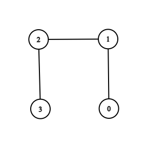

# Grafos

Um grafo é uma estrutura abstrata de representação de dados, vinda diretamente da matemática que foi apropriada pelos cientistas da computação pra uma variada gama de aplicações. Existem diversos tipos de grafos, sendo que diferentes tipos costumam ser mais adequados para uma ou outra aplicação. Além disso, com o avanço dos estudos na área também foram desenvolvidos algoritmos para se trabalhar com esses tipos de grafos, que veremos mais a frente na disciplina.

## Definições e noções iniciais

1. Vértice, nodo ou nó

São as "bolinhas" no grafo, costumam representar as mais variadas entidades de acordo com o enunciado e a necessidade da aplicação.

2. Arcos ou arestas

São as linhas que representam relações diversas entre vertices, assim como no item anterior essas relações são definidas pela aplicação que está utilizando o grafo. Por exemplo, podemos ter um grafo que possua os nodos "João" e "Maria", pessoas da vida real. Além disso, vamos supor que nesse grafo as arestas representem uma relação de amizade entre os nodos, caso existe uma aresta entre os nodos que representam "João" e "Maria" dizemos que existe uma amizade entre eles.

# Diferentes tipos de grafos

Como dito antes, existem tipos diferentes de grafos que possuem pontos positivos e negativos para algumas gamas de aplicação, vamos passar um por um explicando quais são as características de cada um. Mas já saiba que essencialmente o que muda entre um grafo e outro é o tipo de relação que pode ser representada pelas arestas.

Também existem 3 representações principais de grafos: visual, formal e por matriz. Como diferentes tipos de grafos tem propriedades distintas, isso se reflete nas representações

## Grafos não dirigidos e não valorados/ponderados

Nesse caso, as arestas do nosso grafo não possuem uma direção ou um valor, elas representam simplesmente a existência da relação entre os nodos, sem especificar sentido ou intensidade. Voltando no nosso exemplo de um grafo de amizade, dizemos que se existe uma aresta entre A e B então os dois nodos são amigos. Nesse caso, é a mesma coisa dizer que existe uma aresta entre A e B e dizer que existe uma aresta entre B e A.

- **Representação visual**

## Grafos dirigidos e não valorados/ponderados

Agora adicionamos um sentido as arestas, então nossas relações passam a ter um lado. Modificando um pouco nosso exemplo, pensando no grafo para uma rede social onde a aresta representa uma relação de "Seguir". Podemos dizer que se existe uma aresta entre A e B (e não entre B e A), A segue B. Caso exista uma aresta entre B e A, então B segue A. Podem existir arestas nas duas direções entre o mesmo nodo.

## Grafos não dirigidos e valorados

Vamos introduzir mais um conceito nessa brincadeira, atribuindo um valor a cada aresta que adicionarmos ao grafo. Nesse caso, um grafo não dirigido. Utilizaremos como exemplo um grafo onde os nodos são cidades e as arestas representam a distância entre essas cidades, como essa distância é a mesma tanto na ida como na volta, podemos omitir o sentido da aresta.

Então ao criar uma aresta de valor 5 entre A e B, dizemos que existe um caminho entre as duas cidades, e que a distância nesse caminho possui o valor 5 (ai você pode escolhe a unidade de distância que bem entender desde que esteja no sistema métrico).

## Grafos dirigidos e valorados

Quando o valor entre A e B for diferente do valor de B para A, precisamos adicionar sentido para as arestas. Usando o mesmo exemplo anterior do grafo com nodos representando cidades, é possível que o caminho entre duas cidades tenha um tamanho diferente entre a ida e a volta por variações no terreno ou outras complicações. Nesse caso, podemos dizer que entre A e B temos um caminho de valor 4 e entre B e A temos um caminho de valor 5.

## Hipergrafos

Em um hipergrafo, uma aresta pode conectar mais de dois nodos, gerando uma representação visual bizarrisma e poucas aplicações reais, já que se você quer conectar A com B e C você pode usar duas arestas. Mas é isso, o negócio existe e tem que saber.

## Multigrafos

Um multigrafo permite que exista mais de uma aresta entre dois nodos, sendo ela dirigida ou não, valorada ou não.

## Grafo completo

Um grafo é dito completo se existem arestas conectando cada par de nodos existentes.

## Grau de um vértice

É a quantidade de vizinhos que esse vértice possui

